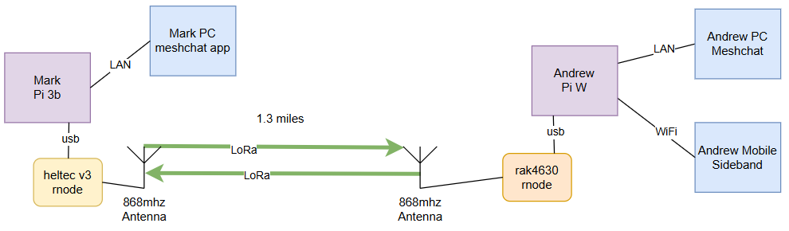

## rnsd-pi

A script to simplify the install rnsd on pi and configure it for LoRa communications for off grid networks.  The goal is to make reticulum more user friendly and reduce the barriers to entry for many.

If you already have your rnode an pi setup, you can run the script paste the following command in your terminal on the pi...

bash -c "$(wget -qLO - https://raw.githubusercontent.com/Andrew-a-g/rnsd-pi/refs/heads/main/rnsd-pi-setup.sh)"

If you are new to this then keep reading to setup your environment...

## About

Reticulum is a network stack on which a chat protocol (LXMF) can run.  It uses any network (interface) to announce on.  You can use this stack to chat to friends in an off grid network over LoRa on frequencies that do not require license.

Read more here..
https://markqvist.github.io/Reticulum/manual/

This script is designed to simplify setup of a pi for reticulum LoRa comms from your home network.  Once setup you can connect to this reticulum pi system with an android phone running sideband or a PC running meshchat.

An example setup would be as follows...
Andrew and Mark are interested in establishing a secure, off-grid communication system. While they appreciate Meshtastic for its capabilities, they desire a solution that supports additional functionality, including picture, voice, and file transfer. Leveraging their existing hardware—such as older Raspberry Pis, Heltec devices, RAK4630 modules, and various antennas—they decide to implement a Reticulum network.

To future-proof their setup and accommodate potential participants, they plan to incorporate meshing capabilities.  This is achieved by enabling the PI as a transport node. With this vision, Andrew and Mark repurpose their equipment and configure the network as follows:

## Getting started

You will need a device to use as an rnode.  This device acts like a modem for reticulum over LoRa.  Supported rnodes are listed here...
https://markqvist.github.io/Reticulum/manual/hardware.html#supported-boards-and-devices

# Section 1 - Flash your rnode device

1. Setting up the rnode on heltec.
2. Grab a Heltec V3 or other supported device. In a chrome web browser head to https://liamcottle.github.io/rnode-flasher/
3. On the flasher site select your rnode model (e.g. Heltec Lora32 V3) as product type.
4. Select model 868Mhz (this is the frequency in the UK / Europe - choose the freqency you wish based on your regional band and equipment)
5. In section 2 click on "official firmware" to be taken to the official github page where you can download the RNode firmware or download this: https://github.com/markqvist/RNode_Firmware/releases/latest
6. Plug in your Heltec V3 into a PC/Mac with Chrome browser.
7. Under section 2 choose the zip file you downloaded and click on Flash Now, select the serial port of your Heltec.
8. Wait for the flashing to complete.

THE NEXT FEW STEPS IT IS IMPORTANT TO DO IN THE EXACT ORDER AND WAIT FOR A SUCCESS MESSAGE BEFORE YOU PROCEED TO THE NEXT STEP

9. Wait for the RNode firmware on your Heltec V3 to boot up.
10. Under section 3 Click on Provision Node, select the serial port of your Heltec and wait until you get a success message.
11. Under section 4 Click on Set Firmware Hash, select the serial port of your Heltec and wait until you get a success message.
Note: If you get messages on the heltec screen like hardware failure ensure to wipe the eeprom and start again from step 10.
12. DO NOT SET FREQUENCY IN SECTION 5
13. Now connect the newly flashed rnode to the pi.

# Section 2 - Setup your pi

Once you have got your rnode up and running you can prepare your pi.  I recommend setting up your pi with a default bookworm install.  Log onto pi console or via putty and paste in the following command to run the reticulum setup script...

bash -c "$(wget -qLO - https://raw.githubusercontent.com/Andrew-a-g/rnsd-pi/refs/heads/main/rnsd-pi-setup.sh)"

You will be prompted to enter the USB port of the rnode, frequency, lora spreading and coding details.

Note: The script defaults to a suitabe frequency in the UK - choose the freqency you wish based on your region and equipment)

It may take a few minutes to run.  Once setup you can configure your LXMF reticulum client.  Note down the details from the script to do this.

# Section 3 - Install a reticulum client

Reticulum clients include nomadnet, meshchat and sideband.  You will need to configure your devices to connect to the pi.  If you have ipv6 enabled on your local LAN it may autoconnect but you can force it to connect by configuring the meshchat app to connect to a TCP server.

1. Download meshchat...
   GitHub project is here: https://github.com/liamcottle/reticulum-meshchat
   Download from here: https://github.com/liamcottle/reticulum-meshchat/releases
2. Open meshchat.
3. Go to interfaces.
4. Click add interface
5. Give the interface a name and then add a tcp client interface.
6. Enter the details of the pi shown at the end of the script.

Other links...
Nomadned client - https://github.com/markqvist/NomadNet
Sideband android app - https://github.com/markqvist/Sideband