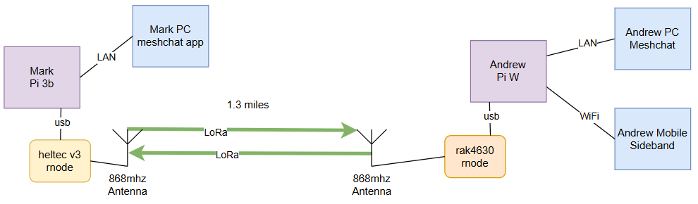

# rnsd-pi

A setup wizard to install and configure Reticulum Network Stack (RNS) on a Raspberry Pi or Linux system for off-grid LoRa mesh communications.

The goal is to make Reticulum more accessible and reduce the barriers to entry — no manual config file editing required.

## Quick Start

If you already have your RNode and Pi ready, paste this command into your terminal:

```bash
bash -c "$(wget -qLO - https://raw.githubusercontent.com/Andrew-a-g/rnsd-pi/refs/heads/main/rnsd-pi-setup.sh)"
```

If you are new to this, keep reading to set up your environment from scratch.

---

## About

Reticulum is a network stack on which the LXMF messaging protocol runs. It works over any available physical link — LoRa, serial, WiFi, TCP/IP, and more. Once set up, you can use it to chat securely with others on an off-grid network using apps like **Sideband** (Android/iOS) or **MeshChat** (PC/Mac/Linux).

Read more: https://markqvist.github.io/Reticulum/manual/

This script turns a Raspberry Pi into a permanent Reticulum LoRa gateway for your local network. Once running, any device on your WiFi can route messages through the LoRa radio automatically.

### Example Network

Andrew and Mark want a secure, off-grid communication system that supports pictures, voice notes and file transfer — beyond what Meshtastic offers. Using older Raspberry Pis, Heltec LoRa devices and some antennas, they build a Reticulum mesh:



The Pi acts as a transport node (meshing enabled), so all traffic is automatically routed between nodes. No IP configuration, routing rules, or addresses to manage.

---

## What the Wizard Installs

The setup wizard walks you through each option with a full-screen blue interface. Everything is installed into a Python virtual environment (`/opt/reticulum-venv`) — no system packages are modified.

| Component | Description | Optional |
|---|---|---|
| **rnsd** | Reticulum transport node with LoRa + TCP server interface | No |
| **LXMF Propagation Server** | Stores and forwards messages for offline devices | Yes |
| **NomadNet** | Hosts micron pages readable by any Reticulum client | Yes |
| **LXMF Distribution Group** | Hosted group messaging (advanced users only) | Yes |

### Wizard Steps

1. **Name your environment** — e.g. `AG` gives you `AG-PropServer`, `AG-NomadNet` etc.
2. **RNode port** — USB serial (`/dev/ttyUSB0`) or TCP (`tcp://192.168.1.115`) for network-connected RNodes
3. **LoRa settings** — frequency presets downloaded from GitHub (defaults to UK 869.431 MHz / 125 kHz BW / SF8 / CR5), or enter manually
4. **Optional components** — LXMF propagation server, NomadNet page hosting, distribution group
5. **Summary and confirm** — review all settings before anything is written

All selected services are configured as systemd units that start automatically on boot in the correct order.

---

## Requirements

- Raspberry Pi (or any Debian Bookworm Linux system)
- A flashed RNode device (see Section 1 below)
- Internet access during install (to download packages and frequency presets)

Run this before starting the wizard:
```bash
sudo apt update && sudo apt upgrade -y
```

---

## Section 1 — Flash Your RNode Device

You need an RNode-compatible device. Supported hardware is listed here:
https://markqvist.github.io/Reticulum/manual/hardware.html#supported-boards-and-devices

### Flashing a Heltec V4 (recommended beginner device)

1. In a Chrome browser, go to: https://liamcottle.github.io/rnode-flasher/
2. Select your device model (e.g. **Heltec Lora32 V4**)
3. Select **868 MHz** (UK/EU) or the appropriate frequency for your region
4. Click **Official Firmware** and download the latest release from:
   https://github.com/markqvist/RNode_Firmware/releases/latest
5. Plug the Heltec V3 into a PC or Mac with Chrome
6. Under Section 2, select the zip file and click **Flash Now**, then select your serial port
7. Wait for flashing to complete

> **Important — do the next steps in order and wait for each success message before proceeding:**

8. Wait for the RNode firmware to boot on the device
9. Section 3 — Click **Provision Node**, select the port, wait for success
10. Section 4 — Click **Set Firmware Hash**, select the port, wait for success

> Note: If you see "hardware failure" on the screen, wipe the EEPROM and repeat from step 9.

11. **Do NOT set frequency in Section 5** — the script handles this
12. Connect the flashed RNode to your Pi via USB

### Optional: Network-Connected RNode (TCP mode)

If you want the RNode to run on a separate, more powerful machine (to reduce power draw on the Pi), you can connect it over WiFi. Run this on the host machine:

```bash
rnodeconf /dev/ttyACM0 -w STATION --ssid your_wifi_ssid --psk your_wifi_password
```

Tip: check your router's DHCP table before and after to identify the RNode's new IP address. Then enter `tcp://192.168.1.x` when the wizard asks for the RNode port.

Note: You may run through the install with a chosen and then run the wifi command on the pi/linux machine at the end.  It should come up after a reboot.

---

## Section 2 — Run the Setup Wizard

With your RNode connected to the Pi, SSH in or open a terminal and run:

```bash
bash -c "$(wget -qLO - https://raw.githubusercontent.com/Andrew-a-g/rnsd-pi/refs/heads/main/rnsd-pi-setup.sh)"
```

The wizard will guide you through all settings. At the end it will display the IP address and port to use when connecting clients.

---

## Section 3 — Connect Reticulum Clients

After setup, any device on your local network can connect to the Pi as a Reticulum gateway.

### MeshChat (PC/Mac/Linux)
- GitHub: https://github.com/liamcottle/reticulum-meshchat
- Releases: https://github.com/liamcottle/reticulum-meshchat/releases

1. Open MeshChat
2. Go to **Interfaces → Add Interface**
3. Add a **TCP Client Interface**
4. Enter the Pi's IP address and port `4242`

### Sideband (Android/iOS)
- Configure a TCP client interface with the same IP and port `4242`
- Or use AutoInterface if IPv6 is enabled on your LAN

### Columba (Android/iOS) (preferred)
- Configure a TCP client interface with the same IP and port `4242`
- Or use AutoInterface if IPv6 is enabled on your LAN

---

## Section 4 — Optional Services

### LXMF Propagation Server

If you chose to install the propagation server, it runs as `lxmd.service`. It stores and forwards LXMF messages so that devices which are temporarily offline can collect them when they reconnect. It announces itself on the mesh automatically.

Config file: `~/.lxmd/config`

### NomadNet Page Hosting

NomadNet runs as `nomadnet.service` and hosts micron-format pages that any Reticulum client can browse. A default welcome page is created at:

```
~/.nomadnetwork/storage/pages/index.mu
```

Edit this file to customise your node's page. The node announces itself on the mesh so clients can discover it. The client identity does not announce (to avoid appearing as "Anonymous Peer").

Micron format docs: https://github.com/markqvist/NomadNet

### LXMF Distribution Group (Advanced)

> Only set this up if you understand how LXMF distribution groups work. They are **not** broadcast messages — they must be hosted on a Reticulum node. Messages can be retained on propagation servers for delivery later.

The group runs as `lxmf-distgroup.service` using SebastianObi's `lxmf_distribution_group_extended` tool.

After the first run, the tool auto-generates `~/.lxmf_distribution_group/config.cfg`. Your settings live in the override file and are never overwritten:

```
~/.lxmf_distribution_group/config.cfg.owr
```

To point the group at your local propagation server after first boot:

```bash
lxmd --info   # copy the propagation node destination hash
```

Then edit `config.cfg.owr` and uncomment:
```ini
[lxmf]
propagation_node = <hash here>
```

Then restart the service:
```bash
sudo systemctl restart lxmf-distgroup
```

Full docs: https://github.com/SebastianObi/LXMF-Tools/tree/main/lxmf_distribution_group_extended

---

## Services Overview

All services are managed by systemd and start automatically on boot in the correct dependency order.

| Service | Depends on | Start delay |
|---|---|---|
| `rnsd.service` | network, time-sync | 5s |
| `lxmd.service` | rnsd | 40s |
| `nomadnet.service` | rnsd | 40s |
| `lxmf-distgroup.service` | lxmd | 60s |

The delays ensure Reticulum has fully initialised before dependent services attempt to connect.

Useful commands:
```bash
sudo systemctl status rnsd lxmd nomadnet lxmf-distgroup
sudo journalctl -u lxmd -n 50 --no-pager
rnsd -vvv   # run interactively for debugging
```

---

## Frequency Presets

The wizard downloads `frequency_presets.yaml` from this repository at install time. This file contains common regional LoRa presets (UK/EU, US, AU/NZ, AS923, India, long-range, high-speed).

To add your own preset, edit `frequency_presets.yaml` in this repository following the existing format.

Feel free to submit a PR for new presets.

UK default (built-in fallback if download fails):
- Frequency: 869.431 MHz
- Bandwidth: 125 kHz
- Spreading Factor: 8
- Coding Rate: 5

---

## Troubleshooting

**Services not starting after reboot**
```bash
sudo systemctl status lxmd nomadnet
sudo journalctl -u lxmd -n 30 --no-pager
```

**NomadNet not showing or "Anonymous Peer"**
The client section is not announcing. If you require it ensure `~/.nomadnetwork/config` has:
```ini
[client]
  announce_at_start = yes
  announce_interval = 360
```

**Distribution group restarting repeatedly**
Check the journal — likely the propagation node hash hasn't been set yet in `config.cfg.owr`.

**RNode not found on USB**
Check `ls /dev/ttyUSB* /dev/ttyACM*` — try both paths. You may need to add your user to the `dialout` group:
```bash
sudo usermod -aG dialout $USER
```
Then log out and back in.
